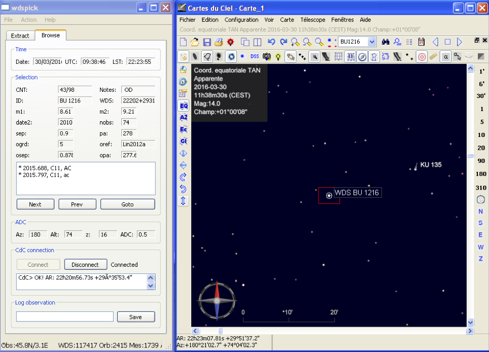

WDSPICK 
====

**WdsPick** is a program to help to astronomers making measurements of double stars.  **WdsPick** offers two
complementary functions.

* a filter-based mechanism for building lists of target stars from the
[Washington Double Star Catalog](http://www.astro.gsu.edu/wds) and navigating through these lists.

* a connection to the well-known [SkyChart](https://www.ap-i.net/skychart/start?id=en/start)
application for automatically visualizing star positions and pointing telescopes.

The image above shows both the **WdsPick** and _SkyChart_ applications side by side (left and right
respectively). Here **WdsPick** is navigating through a list of 98 target stars. The current
selection is BU 1216, whose main elements are shown including ephemerides computed from the [Sixth
Catalog of Orbits of Visual Binary Stars](http://astro.gsu.edu/wds/orb6/orb6text.html).  A connection has
been established with the _SkyChart_ application and the latter has been instructed to point to the
corresponding position. If the _SkyChart_ application is actually controling a telescope (by means of
an ASCOM interface, for example), initiating a physical GOTO would then automatically bring the
target star in the FOV (or the camera)/

DOCUMENTATION
-------------

The project web page (including links for downloading the tools) is 
[here](http://www.astrosurf.com/legalet/Astro/WdsPIck.html).

The user manual can be found
[here](http://www.astrosurf.com/legalet/software/wdspick/WdsPick-manual.pdf).

A short paper describing **WdsPick** was published in the [Journal of Double Star
Observations](http://jdso.org), vol 12(6), pp 535--540.

INSTALLATION
------------

Prebuilt Windows and MacOS versions can be downloaded from the [project
webpage](http://www.astrosurf.com/legalet/Astro/WdsPIck.html)
or from the [releases](https://github.com/jserot/wdspick/releases) section of this repo.
